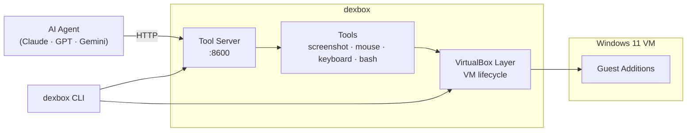

# Dexbox

[](https://discord.gg/Bga4QkvEgZ)

A Windows desktop developer tool for creating computer-use AI agents. Dexbox manages Windows desktops — either VirtualBox VMs or external RDP targets — and exposes an HTTP API that any AI agent (Claude, GPT, Gemini) can call directly. No agent loop, no SDK, just pipe tool calls through.

## Demo

https://github.com/user-attachments/assets/50d50af4-829d-4cb1-a0c0-60bb4d4401a4

## Requirements

- [Go 1.24+](https://go.dev/doc/install)
- [VirtualBox](https://www.virtualbox.org/) (auto-installed by `dexbox create vm`) — for VM desktops
- [Docker](https://www.docker.com/) — for RDP desktops (runs guacd via `docker run`)
- macOS, Linux, or Windows

## Quick Start

Clone and install the CLI

```bash
git clone https://github.com/getnenai/dexbox.git
cd dexbox
make
```

> **Note:** `make` installs `dexbox` to `~/.local/bin`. Ensure this directory is on your `PATH`:
>
> ```bash
> export PATH="$HOME/.local/bin:$PATH"  # add to ~/.zshrc or ~/.bashrc
> ```

Provision a Windows 11 VM (downloads ISO, creates VM, runs unattended install)

The `--iso` is required for ARM hosts like Apple Silicon only.

```bash
dexbox create vm windows-1 --iso /path/to/windows.iso
```

Start the tool server (also starts vboxwebsrv and guacd if Docker is available)

```bash
dexbox start
```

Bring a desktop online

```bash
# Boot a VM
dexbox up windows-1

# Or connect to an RDP target (register it first)
dexbox rdp add my-server --host 192.168.1.100 --user Administrator --pass secret
dexbox up my-server
```

Open the browser-based viewer

```bash
dexbox view windows-1
```

Take a screenshot

```bash
dexbox run --type computer --action screenshot > shot.png
```

Run a PowerShell command

```bash
dexbox run --type bash --command "echo hello"
```

Stop when done

```bash
dexbox stop
```

### Shared folder

Files in `~/.dexbox/shared/` on the host are accessible inside the Windows VM at `\\vboxsvr\shared\`. This mapping is configured automatically during `dexbox create vm`.

```bash
# Host → Guest
echo "hello from host" > ~/.dexbox/shared/test.txt
# Inside the VM, read it at: \\vboxsvr\shared\test.txt

# Guest → Host
# Write a file to \\vboxsvr\shared\ inside Windows, then read it on the host:
cat ~/.dexbox/shared/from-guest.txt
```

### Shell completion (macOS + zsh)

Add to `~/.zshrc`:

```zsh
source <(dexbox completion zsh)
```

Then reload:

```zsh
source ~/.zshrc
```

## Agents

Two reference agents are included. Both require a running dexbox instance (`dexbox start`).

### TypeScript (Vercel AI SDK)

Supports Claude (default), Lux Actor (`lux-actor-1`), and Lux Thinker (`lux-thinker-1`) models.

```bash
cd agent/typescript-vercel-ai
npm install
cp ../.env.example ../.env  # add your ANTHROPIC_API_KEY and/or OAGI_API_KEY

npx tsx src/index.ts "Take a screenshot of the desktop"
npx tsx src/index.ts --model lux-actor-1 "Open Edge and go to google.com"
npx tsx src/index.ts --model lux-thinker-1 "Find and open the calculator app"
```

### Python (LangChain)

```bash
cd agent/python-langchain
uv sync
cp ../.env.example ../.env  # add your ANTHROPIC_API_KEY

uv run python agent.py
```

## How It Works

Dexbox is a **tool server**, not an agent. Your AI agent framework calls the HTTP API with tool actions in the model's native format. Dexbox parses, executes, and returns results — zero translation needed on your side.

```
Your Agent Framework (Vercel AI SDK, LangChain, etc.)
  │  1. GET /tools  →  JSON Schema for all tools
  │  2. Build SDK tool definitions from schema
  │  3. Model returns a tool call
  │  4. POST /actions?model=claude-sonnet-4-5-20250929  →  forward raw tool call
  │  5. Dexbox executes, returns result in the model's format
  v
Dexbox Tool Server (:8600)
  ├── /tools               →  model-agnostic JSON Schema for all tools
  ├── /actions             →  execute a tool action (model-specific format)
  ├── /actions/batch       →  batch sequential actions
  ├── /vm                  →  VM lifecycle (create, start, stop, pause, resume, destroy)
  ├── /desktops            →  list all desktops (VMs + RDP)
  ├── /desktops/<n>/up     →  bring a desktop online
  ├── /desktops/<n>/down   →  disconnect / shut down a desktop
  ├── /desktops/<n>/view   →  browser-based remote desktop viewer (HTML)
  ├── /desktops/<n>/tunnel →  WebSocket tunnel to guacd (Guacamole protocol)
  └── /health
         │
         ├── computer  →  VBoxManage (screenshots, scancodes) + SOAP (mouse)
         └── bash      →  VBoxManage guestcontrol → PowerShell
                │
                ├── VirtualBox VM (Windows 11, headless)
                └── RDP target ─── guacd (Docker) ──→ remote host
```

## API

### Get tool schemas

Returns model-agnostic JSON Schema for all tools. SDKs use this to dynamically build tool definitions instead of hardcoding them.

```bash
curl localhost:8600/tools
```

Response includes full parameter schemas with types, enums, descriptions, and required fields for each tool (computer, bash).

### Execute a tool action

Forward the model's raw tool call JSON. Dexbox parses it, executes, and returns the result in the model's expected format.

```bash
# Screenshot
curl -X POST 'localhost:8600/actions?model=claude-sonnet-4-5-20250929' \
  -H 'Content-Type: application/json' \
  -d '{"type":"computer_20250124","action":"screenshot"}'

# Raw PNG (content negotiation)
curl -X POST 'localhost:8600/actions?model=claude-sonnet-4-5-20250929' \
  -H 'Accept: image/png' \
  -d '{"type":"computer_20250124","action":"screenshot"}' -o shot.png

# Click
curl -X POST 'localhost:8600/actions?model=claude-sonnet-4-5-20250929' \
  -d '{"type":"computer_20250124","action":"left_click","coordinate":[500,300]}'

# Type text
curl -X POST 'localhost:8600/actions?model=claude-sonnet-4-5-20250929' \
  -d '{"type":"computer_20250124","action":"type","text":"hello world"}'

# PowerShell
curl -X POST 'localhost:8600/actions?model=claude-sonnet-4-5-20250929' \
  -d '{"type":"bash_20250124","command":"Get-Process | Select-Object -First 5"}'

```

### Batch actions

Execute multiple actions sequentially in a single request.

```bash
curl -X POST 'localhost:8600/actions/batch?model=claude-sonnet-4-5-20250929' \
  -d '[
    {"type":"computer_20250124","action":"left_click","coordinate":[500,300]},
    {"type":"computer_20250124","action":"screenshot"}
  ]'
```

### VM lifecycle

```bash
# List VMs
curl localhost:8600/vm

# Create a new VM
curl -X POST localhost:8600/vm -d '{"name":"my-vm"}'

# Start / stop / pause / suspend / resume
curl -X POST localhost:8600/vm/my-vm/start
curl -X POST localhost:8600/vm/my-vm/stop
curl -X POST localhost:8600/vm/my-vm/pause
curl -X POST localhost:8600/vm/my-vm/suspend
curl -X POST localhost:8600/vm/my-vm/resume

# Status
curl localhost:8600/vm/my-vm/status

# Destroy
curl -X DELETE localhost:8600/vm/my-vm
```

### Desktop lifecycle (VMs and RDP)

A unified API over all desktop types (VMs and RDP connections).

```bash
# List all desktops
curl localhost:8600/desktops
curl 'localhost:8600/desktops?type=vm'
curl 'localhost:8600/desktops?type=rdp'

# Bring a desktop online
curl -X POST localhost:8600/desktops/my-desktop/up

# Disconnect (session only, VM keeps running)
curl -X POST localhost:8600/desktops/my-desktop/down

# Disconnect + ACPI shutdown (VM only)
curl -X POST 'localhost:8600/desktops/my-desktop/down?shutdown=true'

# Hard poweroff (VM only)
curl -X POST 'localhost:8600/desktops/my-desktop/down?shutdown=true&force=true'

# Shut everything down
curl -X POST localhost:8600/desktops/down-all
curl -X POST 'localhost:8600/desktops/down-all?force=true'

# Browser viewer (returns HTML, open in browser)
curl localhost:8600/desktops/my-desktop/view
```

### Error responses

```json
400  {"error": "bad_request",    "message": "field 'coordinate' required for action 'left_click'"}
400  {"error": "unknown_model",  "message": "Unknown model 'foo'", "supported_prefixes": ["claude-","gpt-","o1-","o3-","gemini-"]}
404  {"error": "vm_not_found",   "message": "VM 'foobar' does not exist"}
409  {"error": "vm_exists",      "message": "VM 'my-vm' already exists"}
502  {"error": "vm_unavailable", "message": "VM 'my-vm' is not running"}
500  {"error": "tool_error",     "message": "VBoxManage screenshotpng failed: ..."}
```

## CLI Reference

### System commands

| Command                                  | Description                                       |
| ---------------------------------------- | ------------------------------------------------- |
| `dexbox start`                           | Start the tool server, vboxwebsrv, and guacd      |
| `dexbox stop`                            | Stop the tool server, vboxwebsrv, and guacd       |
| `dexbox status`                          | Show VM states and RDP connections                 |
| `dexbox create vm <name> [--iso <path>]` | Install VirtualBox and provision a new Windows VM |

### Desktop commands

| Command                        | Description                                    |
| ------------------------------ | ---------------------------------------------- |
| `dexbox up <name>`             | Bring a desktop online (boot VM or verify RDP) |
| `dexbox down <name>`           | Disconnect a desktop session                   |
| `dexbox down --all`            | Shut down all desktops                         |
| `dexbox list`                  | List all desktops (VMs and RDP)                |
| `dexbox view <name>`           | Open desktop in the browser                    |

### VM commands

| Command                     | Description                        |
| --------------------------- | ---------------------------------- |
| `dexbox vm list`            | List all VMs                       |
| `dexbox vm start [name]`    | Start a VM                         |
| `dexbox vm stop [name]`     | Graceful ACPI shutdown             |
| `dexbox vm poweroff [name]` | Immediately cut power (force stop) |
| `dexbox vm pause [name]`    | Freeze VM in memory                |
| `dexbox vm suspend [name]`  | Save state to disk and power off   |
| `dexbox vm resume [name]`   | Resume from pause or suspend       |
| `dexbox vm status [name]`   | Show VM state and guest additions  |
| `dexbox vm destroy [name]`  | Delete VM and disk                 |

If `[name]` is omitted and exactly one VM exists, it is used automatically.

### RDP commands

| Command                                                              | Description                            |
| -------------------------------------------------------------------- | -------------------------------------- |
| `dexbox rdp add <name> --host <h> --user <u> --pass <p>`            | Register an RDP connection             |
| `dexbox rdp remove <name>`                                           | Unregister an RDP connection           |
| `dexbox rdp list`                                                    | List RDP connections                   |
| `dexbox rdp connect <name>`                                          | Verify RDP target (alias for `up`)     |
| `dexbox rdp disconnect <name>`                                       | Disconnect RDP (alias for `down`)      |

### Tool action commands

```bash
dexbox run --type computer --action screenshot > shot.png
dexbox run --type computer --action left_click --coordinate 500,300
dexbox run --type computer --action type --text "hello"
dexbox run --type computer --action key --text "ctrl+a"
dexbox run --type bash --command "dir"
```

## Multi-Model Support

Adding support for a new model family requires implementing one `ModelAdapter` interface:

```go
type ModelAdapter interface {
    ToolDefinitions(capabilities []string, display DisplayConfig) []json.RawMessage
    ParseToolCall(raw json.RawMessage) (*CanonicalAction, error)
    FormatResult(action *CanonicalAction, result *CanonicalResult) (json.RawMessage, error)
}
```

Built-in adapters: Anthropic (`claude-*`), OpenAI (`gpt-*`, `o1-*`, `o3-*`), Gemini (`gemini-*`).

## Environment Variables

| Variable                   | Default                  | Description              |
| -------------------------- | ------------------------ | ------------------------ |
| `DEXBOX_VM_NAME`           | `dexbox-win11`           | Default VM name          |
| `DEXBOX_VM_USER`           | `dexbox`                 | Guest OS username        |
| `DEXBOX_VM_PASS`           | `dexbox123`              | Guest OS password        |
| `DEXBOX_SOAP_ADDR`         | `http://localhost:18083` | vboxwebsrv endpoint      |
| `DEXBOX_SHARED_DIR`        | `~/.dexbox/shared`       | Host-side shared folder  |
| `DEXBOX_LISTEN`            | `:8600`                  | Server listen address    |
| `DEXBOX_SCREENSHOT_WIDTH`  | `1024`                   | Screenshot resize width  |
| `DEXBOX_SCREENSHOT_HEIGHT` | `768`                    | Screenshot resize height |

The CLI loads a `.env` file from the current directory automatically. Use `--env-file` to specify a different path.

## Architecture



### Package overview

```
agent/
├── typescript-vercel-ai/  TypeScript agent (Vercel AI SDK)
├── python-langchain/      Python agent (LangChain)
└── shared/                Shared modules (Extend parse)
internal/
├── vbox/
│   ├── cli.go          VBoxManage CLI wrapper
│   ├── soap.go         SOAP client for mouse control
│   ├── scancodes.go    PS/2 scancode table
│   ├── nvram.go        EFI NVRAM patching for ARM boot
│   ├── manager.go      VM lifecycle orchestration
│   ├── install.go      Provisioning logic
│   └── autounattend.xml  Windows answer file (embedded)
├── tools/
│   ├── schema.go       Typed param structs + JSON Schema generator
│   ├── computer.go     Screenshot, keyboard, mouse via VBox
│   ├── bash.go         PowerShell via Guest Additions
│   ├── adapter.go      ModelAdapter interface + registry
│   ├── adapter_anthropic.go
│   ├── adapter_openai.go
│   └── adapter_gemini.go
├── desktop/              Unified desktop abstraction (VM + RDP)
├── server/
│   └── server.go       HTTP tool server
├── web/                  Browser-based remote desktop viewer
├── guacd/                Apache Guacamole (guacd) Docker management
├── config/
│   └── config.go       Environment configuration
└── logger/
    └── logger.go       JSONL log rendering
```

## License

This project is licensed under the [Apache License 2.0](LICENSE).
